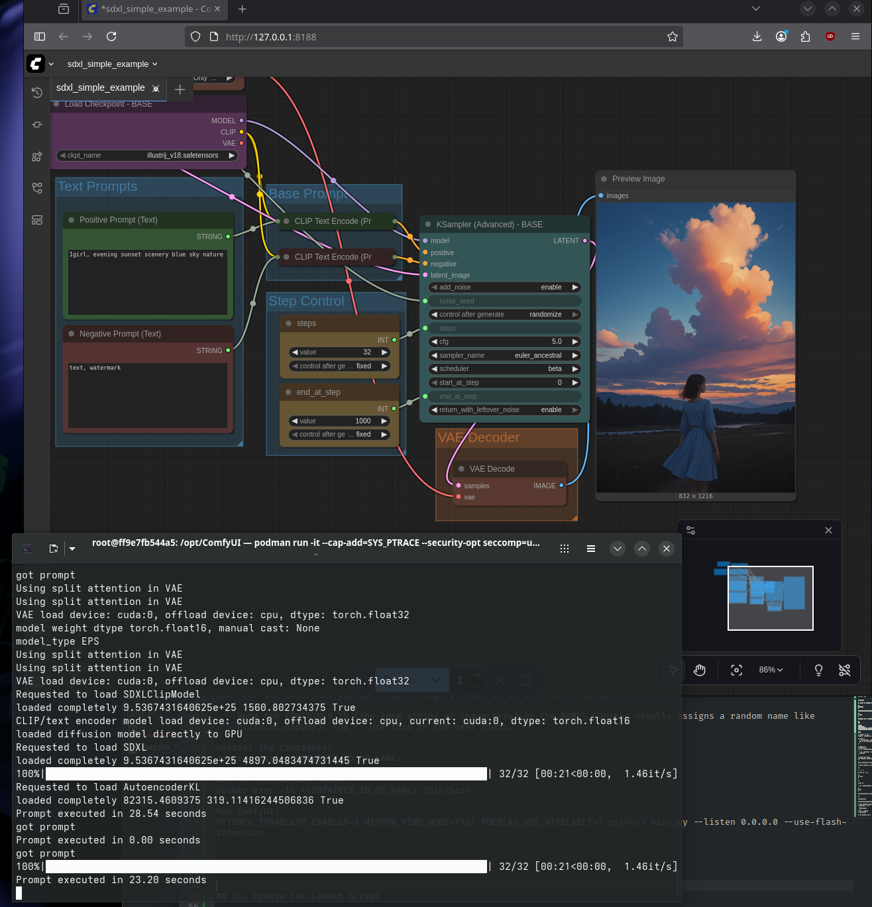

# **ComfyUI Installation and Launch Guide (ROCm/Podman)**

This guide provides step-by-step instructions for installing and running **ComfyUI** within a containerized environment (using **Podman** as a drop-in replacement for Docker) specifically configured for **ROCm GFX1151** compatibility.

Performance is pretty reasonable, generating a basic image using Illustrious at 832x1216 at 32 steps in about 21 seconds

## **1\. Initial Setup: Alias docker to podman**

Since the provided commands use the docker syntax, we set up an alias so that your system executes podman when you type docker.

1. **Open your shell configuration file** (usually \~/.bashrc or \~/.zshrc).  
2. **Add the following line** to the end of the file:  
   alias docker='podman'

3. **Save the file and reload your shell configuration**:  
   source \~/.bashrc  
   \# or source \~/.zshrc

   You can now proceed with the docker commands in the next steps, which will automatically run via podman.

## **2\. Step-by-Step Installation**

These commands create your environment, clone the ComfyUI repository, and install the necessary dependencies, including specific PyTorch wheel files.

### **A. Container Setup and Cloning**

1. **Create the ComfyUI Directory** on your host machine:  
   mkdir ComfyUI

2. **Run the container**. This command starts the ROCm development image, maps your local ComfyUI directory to /opt/ComfyUI, exposes port 8188, and places you inside an interactive shell:  
   docker run \-it \--cap-add=SYS\_PTRACE \--security-opt seccomp=unconfined \--device=/dev/kfd \--device=/dev/dri \--group-add video \-v \`pwd\`/ComfyUI:/opt/ComfyUI \-p 8188:8188 \--ipc=host ghcr.io/rocm/therock\_pytorch\_dev\_ubuntu\_24\_04\_gfx1151:main

3. **Navigate to the installation directory** inside the container:  
   cd opt/ComfyUI

4. **Install git** and clone the ComfyUI repository:  
   apt update  
   apt install git \-y  
   git clone \[https://github.com/comfyanonymous/ComfyUI\](https://github.com/comfyanonymous/ComfyUI) .

### **B. Dependency Installation and Launch**

1. **Uninstall any existing PyTorch packages** to prevent conflicts:  
   pip uninstall torch torchvision torchaudio \--break-system-packages \-y

2. **Install ROCm core packages**:  
   pip install \--index-url \[https://d2awnip2yjpvqn.cloudfront.net/v2/gfx1151/\](https://d2awnip2yjpvqn.cloudfront.net/v2/gfx1151/) rocm\[libraries,devel\] \--break-system-packages

3. **Install specific wheel files**.**Note:** You must first **download the torch wheel files and put them in your bazzite ComfyUI directory** (Host Machine: ComfyUI/). The necessary files can be found here: https://github.com/pccr10001/comfyui-gfx1151-fa.  
   pip install ./torch-2.8.0a0+gitba56102-cp312-cp312-linux\_x86\_64.whl ./torchaudio-2.8.0a0+6e1c7fe-cp312-cp312-linux\_x86\_64.whl ./torchvision-0.23.0a0+824e8c8-cp312-cp312-linux\_x86\_64.whl  ./flash\_attn-2.0.4-cp312-cp312-linux\_x86\_64.whl  \--break-system-packages

4. **Install the remaining requirements**:  
   pip install \-r requirements.txt \--break-system-packages

5. **Configure dynamic linker run-time bindings**:  
   echo /usr/local/lib/python3.12/dist-packages/\_rocm\_sdk\_core/lib \>\> /etc/ld.so.conf  
   ldconfig

6. **Run ComfyUI** (inside the container):  
   PYTORCH\_TUNABLEOP\_ENABLED=1 MIOPEN\_FIND\_MODE=FAST ROCBLAS\_USE\_HIPBLASLT=1 python3 main.py \--listen 0.0.0.0 \--use-flash-attention

7. **Access the GUI** in your web browser:  
   \[http://0.0.0.0:8188\](http://0.0.0.0:8188)

## **3\. How to Open ComfyUI Again (Manual Restart)**

If you close the shell or restart your machine, the container will exit. Here’s how to get back into it.

1. **List all containers** to find the stopped one:  
   docker ps \-a

2. **Note the container ID or Name** (e.g., ecstatic\_hopper).  
3. **Restart the Container**:  
   docker start \<CONTAINER\_ID\_OR\_NAME\>

4. **Get an Interactive Shell** inside the running container:  
   docker exec \-it \<CONTAINER\_ID\_OR\_NAME\> /bin/bash

5. **Run ComfyUI**:  
   PYTORCH\_TUNABLEOP\_ENABLED=1 MIOPEN\_FIND\_MODE=FAST ROCBLAS\_USE\_HIPBLASLT=1 python3 main.py \--listen 0.0.0.0 \--use-flash-attention

## **4\. Launch Script Automation (Recommended)**

To simplify the process of restarting and launching ComfyUI, you can create a shell script.

### **A. Create the Launch Script**

1. **Navigate to your ComfyUI directory** on the **host machine**:  
   cd /var/home/<your-computer-name-here>/ComfyUI/

2. **Create a new file** named launch\_comfy.sh:  
   nano launch\_comfy.sh

3. **Paste the following content** into the file:  
   \#\!/bin/bash

   \# \--- Configuration \---  
   \# \!\! IMPORTANT: Update CONTAINER\_NAME if you used a specific name during initial run \!\!  
   CONTAINER\_NAME="comfyui\_rocm\_container\_name"   
   COMFY\_CMD="PYTORCH\_TUNABLEOP\_ENABLED=1 MIOPEN\_FIND\_MODE=FAST ROCBLAS\_USE\_HIPBLASLT=1 python3 main.py \--listen 0.0.0.0 \--use-flash-attention"

   \# \--- Logic \---

   \# 1\. Check if the container exists (including stopped ones)  
   CONTAINER\_STATUS=$(docker ps \-a \--filter "name=$CONTAINER\_NAME" \--format "{{.Status}}")

   if \[ \-z "$CONTAINER\_STATUS" \];  
   then  
       echo "Container '$CONTAINY\_NAME' not found. You need to run the initial 'docker run' command again to create it."  
       exit 1  
   fi

   \# 2\. Check if the container is running (using podman due to the alias)  
   if \[\[ "$CONTAINER\_STATUS" \== Running\* \]\];  
   then  
       echo "Container is already running. Attaching shell and launching ComfyUI..."  
   else  
       echo "Container is stopped ($CONTAINER\_STATUS). Starting it now..."  
       podman start "$CONTAINER\_NAME"  
   fi

   \# 3\. Execute the ComfyUI launch command inside the running container (using podman due to the alias)  
   podman exec \-it "$CONTAINER\_NAME" /bin/bash \-c "cd /opt/ComfyUI && $COMFY\_CMD"

4. **Save and close the file**.

### **B. Make the Script Executable**

chmod \+x launch\_comfy.sh

### **C. Launch with the Script**

./launch\_comfy.sh

## **5\. Create a Desktop Shortcut (Optional)**

You can create a desktop launcher to execute the script with a single click.

1. **Navigate to your desktop directory** (Host Machine):  
   cd /var/home/<your-computer-name-here>/Desktop

2. **Create a new file** named ComfyUI.desktop:  
   nano ComfyUI.desktop

3. **Paste the following content**:  
   \[Desktop Entry\]  
   Comment=Launch ComfyUI in a Docker Container  
   Exec=/var/home/<your-computer-name-here>/ComfyUI/launch\_comfy.sh  
   GenericName=ComfyUI Launcher  
   Icon=application-x-executable  
   Name=ComfyUI  
   StartupNotify=true  
   Terminal=true  
   Type=Application  
   Version=1.0

4. **Save and close the file**.  
5. **Make the Desktop Entry Executable**:  
   chmod \+x ComfyUI.desktop  
